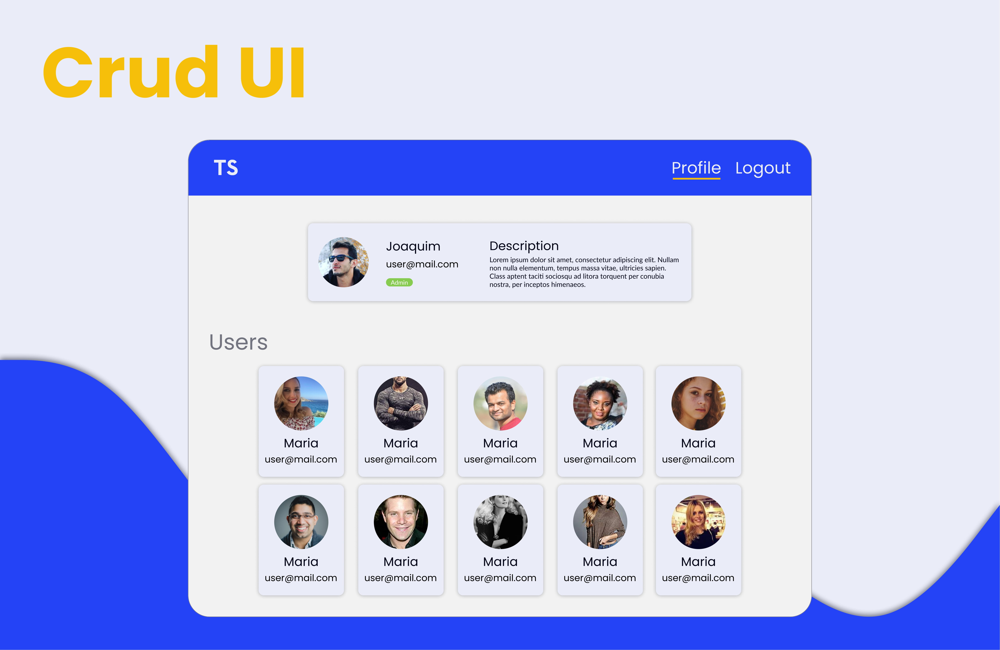

# Crud interface UI
Criei esse projeto para consumir um futuro CRUD que criarei.

  

## Desenvolvimento
Foi muito interessante desenvolver tudo do zero, até o styleguide. 
Escolhi as fontes, cores e por ai vai. Essa foi uma das principais motivações do projeto.
### Dificuldades
A parte mais difícil do UI é manter as proporções, como meu monitor é muito
pequeno, sempre ficava muito diferente. Isso me fez começar a usar outras
medidas ao invés de PX, o REM foi essencial. Acredito que com ele fica muito mais
fácil manipular os componentes e manter sua consistência no design.

Como dito lá em cima, uma outra motivação que tive foi
criar um fluxo para o usuário. Dividi isso em 3 coisas:

1. Desenvolver formulários.
2. Desenvolver componentes reutilizáveis.
3. Mante-lo coeso e agradável.

## Tecnologias
Nesse projeto decidi usar uma stack onde me sinto mais confortavél.
- [NextJS](https://nextjs.org/)
- [Styled components](https://styled-components.com/)
- [Typescript](https://www.typescriptlang.)

---
Não finalizado
---